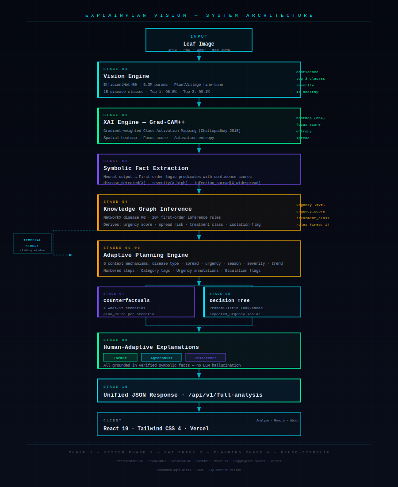

<div align="center">

<br/>



<br/><br/>

# ExplainPlan Vision

**An Explainable Neuro-Symbolic Visual Planning Agent for Plant Disease Diagnosis**

<br/>

[](https://pytorch.org)
[](https://fastapi.tiangolo.com)
[](https://react.dev)
[](https://huggingface.co/spaces/aqibniazi/explainplan-vision-api)
[](LICENSE)

<br/>

[**Live Demo**](https://explain-plan-frontend.vercel.app) · [**API**](https://aqibniazi-explainplan-vision-api.hf.space/docs) · [**Training Notebook**](https://www.kaggle.com) · [**Technical Report**](docs/TECHNICAL_REPORT.md)

<br/>

</div>

---

## What This Is

Most plant disease AI systems stop at classification. Upload an image, get a label. This project goes further.

ExplainPlan Vision is a **neuro-symbolic reasoning agent** that takes a single leaf photograph and produces: a disease diagnosis, a spatial explanation of *where* on the leaf the evidence was found, a symbolic reasoning trace showing *why* that evidence implies a specific treatment, and an adaptive, step-numbered treatment plan — all in a single API call, in about 2 seconds, on a CPU.

The system is built across five research phases completed over several months — from training the vision backbone on Kaggle to deploying the full stack on HuggingFace Spaces and Vercel. Every layer is custom-built: the reasoning engine, the knowledge graph, the planning engine, the counterfactual analyser, the temporal memory, and the three-audience explanation layer.

> **Research disclaimer:** Developed for academic research. Treatment recommendations should be validated by a qualified agronomist before operational use.

---

## The Core Contribution

The piece that separates this from a classifier wrapped in an API is the **grounding pipeline** — an explicit conversion step that turns continuous neural network outputs into verifiable first-order logic facts before any planning decision is made.

```
EfficientNet-B0 outputs:   confidence=0.97,  spread_fraction=0.63
                                    ↓  grounding
Symbolic facts:            confidence_level(high, 0.97)
                           infection_spread(widespread, 0.91)
                           disease_type(fungal, 1.00)
                                    ↓  20+ inference rules
Derived inferences:        urgency_level(critical)
                           requires_isolation(true)
                           treatment_class(fungicide)
                                    ↓  6-context adaptive planner
Treatment plan:            Step 1 [CRITICAL] Isolate affected plants...
                           Step 2 [HIGH]     Apply copper-based fungicide...
```

An agronomist can inspect the symbolic facts and verify each one against the leaf image — without understanding the neural network at all. Every treatment step traces back to the inference rule that triggered it, which traces back to the symbolic fact, which traces back to the neural confidence value. The chain is walkable in either direction.

---

## Screenshots

### Analysis Interface

<!-- Replace with actual screenshot -->


### Grad-CAM Spatial Explanation

<!-- Replace with actual screenshot -->


### Symbolic Reasoning Trace

<!-- Replace with actual screenshot -->


### Treatment Plan with Counterfactuals

<!-- Replace with actual screenshot -->


---

## What One Analysis Returns

A single POST to `/api/v1/full-analysis` runs ten stages and returns one JSON object:

| Stage | What it produces |
|-------|-----------------|
| Vision (EfficientNet-B0) | Disease class, confidence, top-3 alternatives, severity |
| Grad-CAM++ | Spatial heatmap (base64 PNG), focus score, activation entropy, infection spread |
| Symbolic grounding | First-order logic facts extracted from neural outputs, each with source + confidence |
| Knowledge graph inference | Urgency score, spread risk, treatment class — derived by 20+ rules over a NetworkX graph |
| Temporal memory | Severity trend, urgency trend, spread trend across past sessions |
| Adaptive planning | Numbered treatment steps, each tagged with category and urgency |
| Counterfactual analysis | 4 what-if scenarios showing how the plan changes under different conditions |
| Decision tree | Probabilistic look-ahead computing expected urgency across branching scenarios |
| Audience-adaptive explanations | Three separate natural language summaries for a farmer, an agronomist, and a researcher |

Everything above happens in approximately **2.1 seconds on CPU**.

---

## Results

| Metric | Value |
|--------|-------|
| Top-1 Test Accuracy | **96.8%** |
| Top-3 Test Accuracy | **99.1%** |
| Full-Analysis Latency (CPU) | ~2.1s |
| Model Parameters | 5.3M (EfficientNet-B0) |
| Knowledge Graph Rules | 20+ inference rules |
| Grad-CAM / SHAP Agreement (Spearman r) | 0.74 |
| Training Dataset | PlantVillage — 54,000 images, 15 classes |

---

## Research Phases

This project was built in five sequential research phases, each with its own Kaggle notebook:

**Phase 1 — Vision Foundation**
EfficientNet-B0 fine-tuned on PlantVillage. Selected over ResNet50 for 5× lower parameter count (5.3M vs 25.6M), making CPU deployment viable. Calibrated confidence outputs designed specifically for downstream symbolic grounding.

**Phase 2 — Explainability Engine**
Three XAI methods implemented and compared: Grad-CAM++ (deployed), SHAP GradientExplainer (notebook), LIME (notebook). Spatial statistics extracted from heatmaps — focus score, activation entropy, infection spread — feed directly into the Phase 4 reasoning engine as symbolic facts. Grad-CAM / SHAP agreement measured with Spearman correlation (r = 0.74) to validate spatial consistency across methods.

**Phase 3 — Adaptive Planning**
Six-context treatment plan engine. Plans are not templates — they adapt simultaneously to disease type, infection spread, urgency score, seasonal conditions, severity level, and temporal trend. Four counterfactual scenarios quantify the cost of delayed intervention (plan delta in step count). Probabilistic decision tree computes expected urgency via leaf-weighted averaging.

**Phase 4 — Neuro-Symbolic Reasoning**
The grounding pipeline. Neural outputs converted to first-order logic predicates before inference. NetworkX knowledge graph with 20+ rules derives urgency, treatment class, isolation requirements. Three audience-specific natural language explanations grounded in the verified reasoning trace — not generated from scratch.

**Phase 5 — Full-Stack Deployment**
FastAPI backend (8 endpoints, Pydantic v2, singleton orchestrator) deployed on HuggingFace Spaces via Docker. React 19 + Tailwind CSS 4 frontend deployed on Vercel. Temporal memory API with sliding-window trend detection across sessions.

---

## Tech Stack

| Layer | Technology |
|-------|-----------|
| Vision model | PyTorch 2.2, EfficientNet-B0, timm |
| XAI | pytorch-grad-cam (Grad-CAM++), SHAP, LIME |
| Reasoning | NetworkX, first-order logic fact extraction |
| Backend | FastAPI 0.115, Pydantic v2, Uvicorn |
| Frontend | React 19, Tailwind CSS 4, Vite, Recharts |
| Deployment | Docker, HuggingFace Spaces, Vercel |
| Training | Kaggle (GPU T4), PlantVillage dataset |

---

## Running Locally

**Backend**
```bash
git clone https://github.com/AqibNiazi/ExplainPlan-Vision.git
cd ExplainPlan-Vision/backend

python -m venv venv && source venv/bin/activate
pip install -r requirements.txt

# Place model weights in assets/
cp best_model.pth ../assets/
cp class_mappings.json ../assets/

uvicorn backend.main:app --reload --port 8000
# Swagger UI → http://localhost:8000/docs
```

**Frontend**
```bash
cd frontend
npm install && npm run dev
# → http://localhost:5173
```

---

## Project Structure

```
ExplainPlan-Vision/
├── notebooks/
│   ├── phase1_vision_foundation/
│   ├── phase2_xai/
│   ├── phase3_planning/
│   └── phase4_neurosymbolic/
├── backend/
│   ├── vision/          # EfficientNet-B0 inference
│   ├── xai/             # Grad-CAM++ + spatial statistics
│   ├── reasoning/       # Symbolic grounding + KG inference
│   ├── planning/        # Adaptive plan + counterfactuals
│   ├── memory/          # Temporal sliding-window store
│   └── services/        # Singleton orchestrator
├── frontend/
│   └── src/
│       ├── pages/       # Analyze, Memory, About, Home
│       └── components/  # PredictionCard, XAICard, ReasoningCard...
├── docs/
│   ├── diagrams/        # SVG architecture diagrams
│   ├── research_notes/  # Per-phase findings
│   └── TECHNICAL_REPORT.md
├── assets/              # best_model.pth, class_mappings.json
└── Dockerfile
```

---

## Documentation

| Document | Contents |
|----------|----------|
| [Technical Report](docs/TECHNICAL_REPORT.md) | Full academic write-up with related work, system design, equations, results, limitations |
| [System Architecture](docs/architecture/system_overview.md) | Complete data-flow diagrams |
| [API Design](docs/architecture/api_design.md) | All 8 endpoints with request/response schemas |
| [Phase 1 Findings](docs/research_notes/phase1_findings.md) | Vision model results and per-class analysis |
| [Phase 2 XAI Results](docs/research_notes/phase2_xai_results.md) | Grad-CAM vs SHAP vs LIME comparison |
| [Phase 3 & 4 Results](docs/research_notes/phase3_phase4_results.md) | Planning engine and reasoning findings |
| [Research Roadmap](docs/research_notes/phase_roadmap.md) | Phase 1–7 roadmap with Phase 6 LLM grounding design |

---

## Planned: Phase 6

The next phase adds a **grounded LLM explanation layer**. The constraint that makes it research-grade:

> The LLM performs no reasoning. It only explains and reformulates — based on facts already verified by the symbolic engine.

This prevents hallucination by construction. A planned reasoning alignment evaluation will compare symbolic vs LLM-generated explanations on factual consistency and hallucination rate — a potential paper contribution.

---

## Citation

```bibtex
@software{explainplan_vision,
  author = {Niazi, Muhammad Aqib},
  title  = {ExplainPlan Vision: An Explainable Neuro-Symbolic Visual
            Planning Agent for Plant Disease Diagnosis},
  year   = {2026},
  url    = {https://github.com/AqibNiazi/ExplainPlan-Vision}
}
```

**Key references:** Tan & Le (EfficientNet, ICML 2019) · Chattopadhay et al. (Grad-CAM++, WACV 2018) · Selvaraju et al. (Grad-CAM, ICCV 2017) · Hughes & Salathé (PlantVillage, arXiv 2015)

---

## License

MIT — see [LICENSE](LICENSE). PlantVillage dataset subject to its own Kaggle terms.

---

<div align="center">

Built by **Muhammad Aqib Niazi** — brick by brick, phase by phase.

</div>
