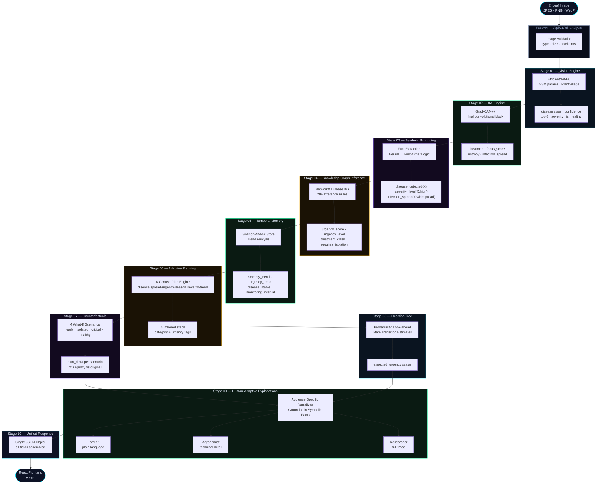

# ExplainPlan Vision — Pipeline Flow Diagram (Mermaid)

Copy this into any Mermaid-compatible renderer (GitHub README, Notion, Obsidian, mermaid.live).

```mermaid
flowchart TD
    IMG([🌿 Leaf Image\nJPEG · PNG · WebP]) --> API

    subgraph API["FastAPI — /api/v1/full-analysis"]
        direction TB
        VAL[Image Validation\ntype · size · pixel dims]
    end

    API --> S1

    subgraph VISION["Stage 01 — Vision Engine"]
        S1[EfficientNet-B0\n5.3M params · PlantVillage]
        S1 --> S1O[disease class · confidence\ntop-3 · severity · is_healthy]
    end

    VISION --> S2

    subgraph XAI["Stage 02 — XAI Engine"]
        S2[Grad-CAM++\nfinal convolutional block]
        S2 --> S2O[heatmap · focus_score\nentropy · infection_spread]
    end

    XAI --> S3

    subgraph SYMBOLIC["Stage 03 — Symbolic Grounding"]
        S3[Fact Extraction\nNeural → First-Order Logic]
        S3 --> S3O["disease_detected(X)\nseverity_level(X,high)\ninfection_spread(X,widespread)"]
    end

    SYMBOLIC --> S4

    subgraph KG["Stage 04 — Knowledge Graph Inference"]
        S4[NetworkX Disease KG\n20+ Inference Rules]
        S4 --> S4O[urgency_score · urgency_level\ntreatment_class · requires_isolation]
    end

    KG --> S5

    subgraph MEM["Stage 05 — Temporal Memory"]
        S5[Sliding Window Store\nTrend Analysis]
        S5 --> S5O[severity_trend · urgency_trend\ndisease_stable · monitoring_interval]
    end

    MEM --> S6

    subgraph PLAN["Stage 06 — Adaptive Planning"]
        S6[6-Context Plan Engine\ndisease·spread·urgency·season·severity·trend]
        S6 --> S6O[numbered steps\ncategory + urgency tags]
    end

    PLAN --> S7
    PLAN --> S8

    subgraph CF["Stage 07 — Counterfactuals"]
        S7[4 What-If Scenarios\nearly · isolated · critical · healthy]
        S7 --> S7O[plan_delta per scenario\ncf_urgency vs original]
    end

    subgraph DT["Stage 08 — Decision Tree"]
        S8[Probabilistic Look-ahead\nState Transition Estimates]
        S8 --> S8O[expected_urgency scalar]
    end

    S7O --> S9
    S8O --> S9

    subgraph EXP["Stage 09 — Human-Adaptive Explanations"]
        S9[Audience-Specific Narratives\nGrounded in Symbolic Facts]
        S9 --> FARM[Farmer\nplain language]
        S9 --> AGRO[Agronomist\ntechnical detail]
        S9 --> RES[Researcher\nfull trace]
    end

    EXP --> S10

    subgraph OUT["Stage 10 — Unified Response"]
        S10[Single JSON Object\nall fields assembled]
    end

    OUT --> FE([React Frontend\nVercel])

    style IMG fill:#0d1225,stroke:#00e5ff,color:#e8f0fe
    style API fill:#090d1a,stroke:#8899bb,color:#8899bb
    style VISION fill:#0a1420,stroke:#00e5ff,color:#e8f0fe
    style XAI fill:#0a1a12,stroke:#00ff9d,color:#e8f0fe
    style SYMBOLIC fill:#120a1f,stroke:#7c4dff,color:#e8f0fe
    style KG fill:#1a1205,stroke:#ffb300,color:#e8f0fe
    style MEM fill:#0a1a12,stroke:#00ff9d,color:#e8f0fe
    style PLAN fill:#1a1205,stroke:#ffb300,color:#e8f0fe
    style CF fill:#120a1f,stroke:#7c4dff,color:#e8f0fe
    style DT fill:#0a1420,stroke:#00e5ff,color:#e8f0fe
    style EXP fill:#0a1a12,stroke:#00ff9d,color:#e8f0fe
    style OUT fill:#0d1225,stroke:#00e5ff,color:#e8f0fe
    style FE fill:#0d1225,stroke:#00e5ff,color:#e8f0fe
```

---

## Alternative — Compact Linear View

```mermaid
graph LR
    A[🌿 Image] --> B[EfficientNet-B0]
    B --> C[Grad-CAM++]
    C --> D[Symbolic Facts]
    D --> E[KG Inference\n20+ Rules]
    E --> F[Temporal Memory]
    F --> G[Adaptive Plan\n6 Contexts]
    G --> H[Counterfactuals\n4 Scenarios]
    G --> I[Decision Tree]
    H --> J[Explanations\nFarmer·Agronomist·Researcher]
    I --> J
    J --> K[Unified JSON\nResponse]

    style A fill:#0d1225,stroke:#00e5ff,color:#e8f0fe
    style B fill:#0d1225,stroke:#00e5ff,color:#e8f0fe
    style C fill:#0d1225,stroke:#00ff9d,color:#e8f0fe
    style D fill:#0d1225,stroke:#7c4dff,color:#e8f0fe
    style E fill:#0d1225,stroke:#ffb300,color:#e8f0fe
    style F fill:#0d1225,stroke:#00ff9d,color:#e8f0fe
    style G fill:#0d1225,stroke:#ffb300,color:#e8f0fe
    style H fill:#0d1225,stroke:#7c4dff,color:#e8f0fe
    style I fill:#0d1225,stroke:#00e5ff,color:#e8f0fe
    style J fill:#0d1225,stroke:#00ff9d,color:#e8f0fe
    style K fill:#0d1225,stroke:#00e5ff,color:#e8f0fe
```
